# Despliegue de un servicio de monitorizacion
1. Instalar y configurar Nagios.

Antes de instalar nagios necesitamos isntalar lo siguiente: 

- Apache
- PHP
- GCC:librerias de desarrollo y compilación>
- GD:librerías de desarrollo

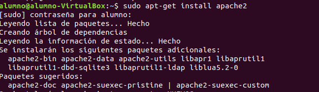

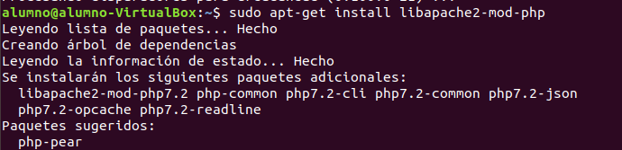

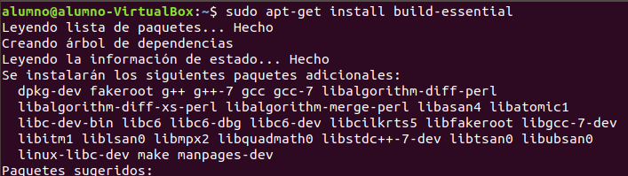

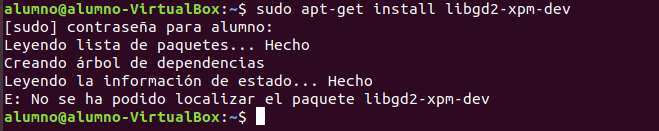

A continuación creamos la información de la cuenta del ususario.

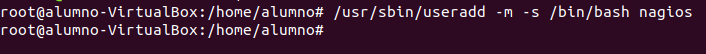

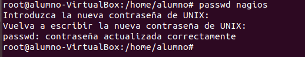

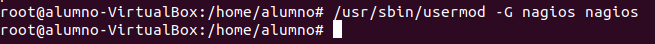

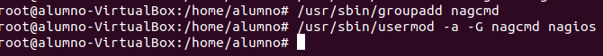

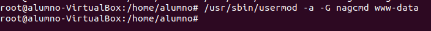

Lo siguiente que haremos será la compilaciín e instalación de Nagios.

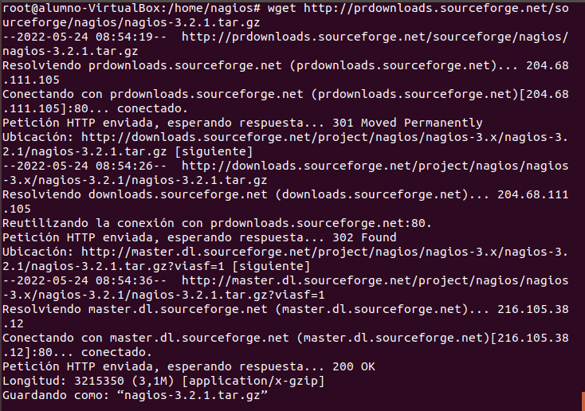

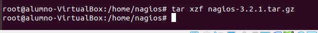

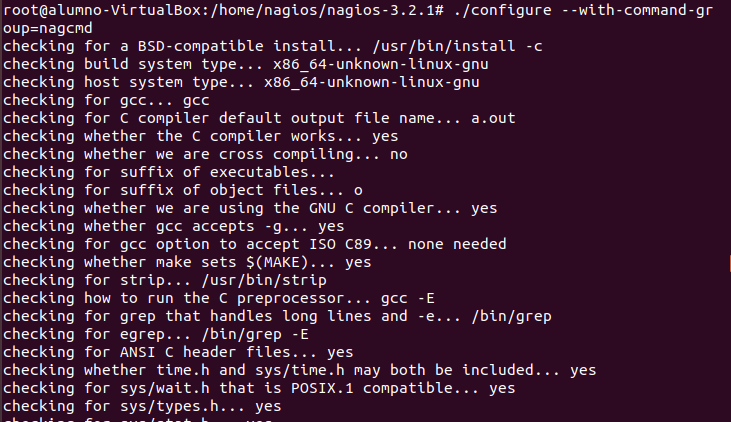

Compilamos el codigo fuente.

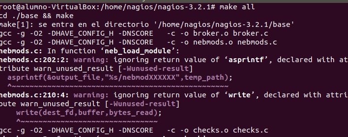

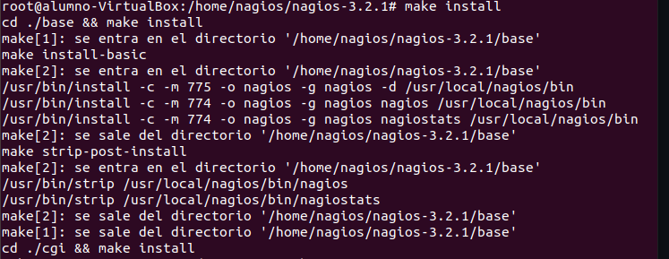

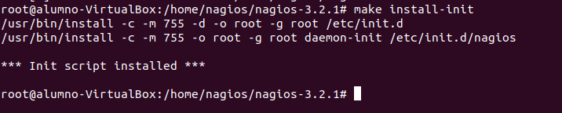

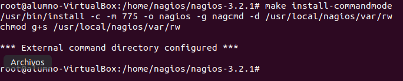

Personalización de la configuración.

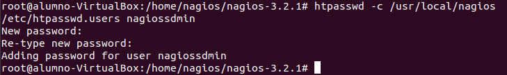

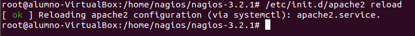

Instalamos los Plugins.
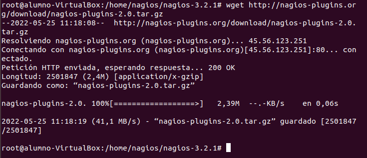

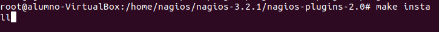

Y ya estría instalado.

[Monitorizar un equipo windows](./maquina.md)

[Monitorizar un servicio de red](./servicio.md)

[Monitorizar la página del centro](./pagina.md)